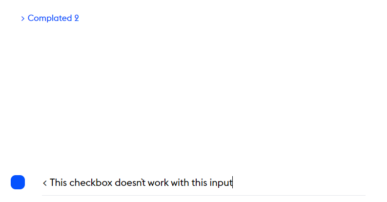
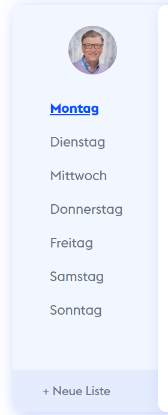
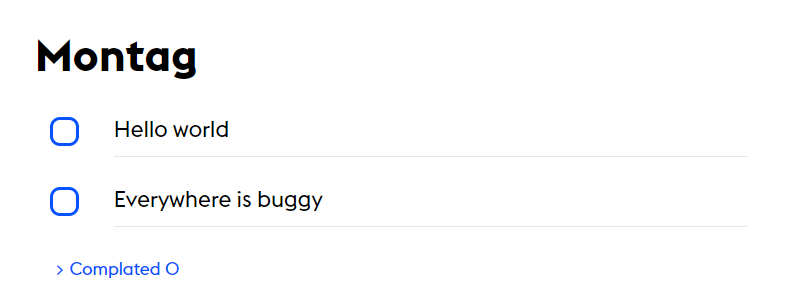
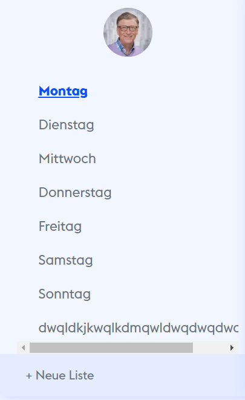

# Checkbox doesn`t work with input **#1**

Checkbox doesnt work with input, when I want to directly make my task done.



## Fixed at line #116 _index.js_

I forgot the add one ternary for the main input checkbox.Just added an ternary as oder lists have.

```js
onSubmit={async (e) => {
    // Bug Fix #1
    // Reconstruct for the push an element to state
    e.preventDefault();
    if (document.getElementById("input-list").value) {
        stateTree.addtoArray(
        setlist,
        list,
        day,
        document.getElementById("input-list").value
        );

        ischecked
        ? stateTree.addtoArray(
            setComplated,
            complated,
            day,
            list[day].length
            )
        : stateTree.deletefromArray(
            setComplated,
            complated,
            day,
            list[day].length
            );
        document.getElementById("input-list").value = "";
    }
    return null;
}}
```

# Days element lenght are not visible **#2**

Days element lenght aren`t visible in left section days element.



## Fixed at line #14 _days-element.jsx_

I noticed Next.js see my array as a object with **typeof** keyword. Then I assigned my variable as Array

```js
  /* Bug Fix #2 */
  /* I noticed Next.js see my array as a object with **typeof** keyword. Then I assigned my variable as Array */
{
  [props.len][0].length > 0 ? (
    <span className="text-gray-500 pointer-events-none font-normal float-right mr-6">
      {[props.len][0].length}
    </span>
  ) : null;
}
```

# List delete icon index issue **#3**

Probably when delete a task dont take her index. Becouse of this problem delete everytime first element from todolist array.



For example when I want to delete `everywhere is buggy` element delete Hello world element.

## Fixed at line #63 _todolist-element.jsx_

Element index not specified at this onclick function.

```js
    <Images
    src="/assets/icons/delete.png"
    alt="delete-icon"
    onClick={() =>
        value.deletefromArray(
        value.todoList[1],
        value.todoList[0],
        value.currentDay[0],
        // Bug Fix #3
        // Added element index to deletefromArray
+       props.index
        )
    }
```

# When new list added appear a overflow **#4**

I see some overflow and text-overflow problems in this section.



## Fixed at line #45 _global.css_

Added to 3 new class for this issue then it fixed.

```css
.w-max-170p .overflow-x-hidden .overflow-ellipsis;
```