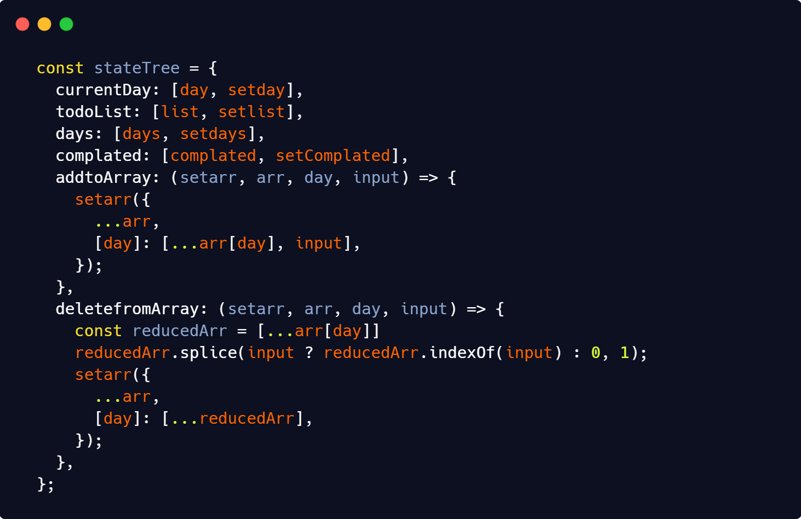
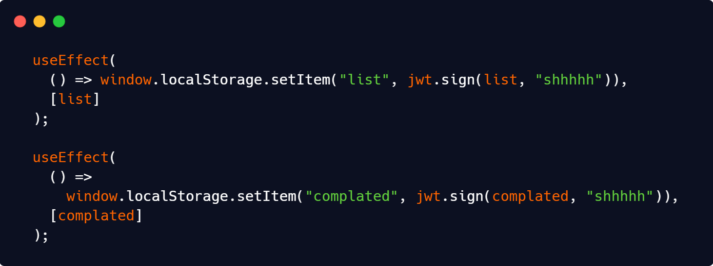
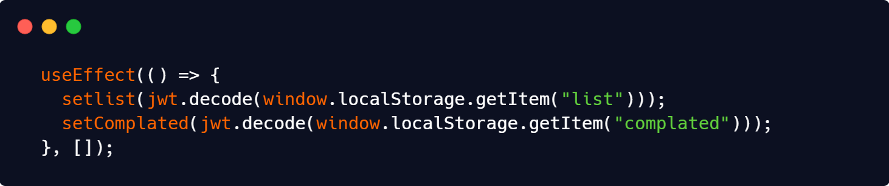

# **Uxactly Task**

I was seriously fun when doing this task, I hope have fun when you reading my documentation.

## How does it work ?
Let`s imagine, you are an average user.Every days have specifiy array for the todo list by current day and your current day is saving to state **day**.Whenever you want enter an input to input your input saving to state **todoList** and at the same time encoding to jsonwebtoken for the saving your list to your computer.Then your one task is done ! you check it so your task index is saving to state **completed** what you checked and of course saving to local storage like same scenario.Your every task is done and want to delete it when your maus is over task will appear two button but unfortunately just work delete button, when you click to delete button your task will delete by your task index from state **complate**.

<br>


## My **stateTree** 
I have a lot of state for this todo list. Becouse of this I compiled my states to one variable for **Context API**
 
* **currentDay** <br>
This state allocate the in which day you are. 
* **todoList** <br>
todoList state allocate your todolist elements.
* **days** <br>
Your days is in days state.
* **complated** <br> 
Whenever you pinned your tasks for done it will be save to this state.
* **addToArray** <br>
I noticed to have use this function for 2 - 3 times and I convert it to an state function for no code repeat.
* **deletefromArray** <br>
I noticed to have use this function for 2 - 3 times and I convert it to an state function for no code repeat.

## What I Did For Storage
I have used **useEffect** from React.js Hooks and set it to whenever her state is change.Its look like this.



For whenever we refresh the page set our states from local storage, I called this function just for one time.



# How to install 
```sh
npm install && npm run build && npm start
```

## What I Used

- [x] Next.js (latest)
- [x] Tailwindcss (2.1.1)
- [x] Postcss (^8.1.10)
- [x] Jsonwebtoken (^8.5.1)
- [x] Local Storage

### Hooks in React.js

- [x] Context API
- [x] useState()
- [x] useEffect()

## Roadmap
* 04.05.2021 | Thinked Design Layout.
* 05.05.2021 | Complated Scripts and Styles.
* 06.05.2021 | Compile My Codes. Writed a README.md Documentation.
* 07.05.2021 | Deliver This Task to Herr Schulz.

# Dass uns der Weg am Ende des Tages wichtiger ist als das Ergebnis 